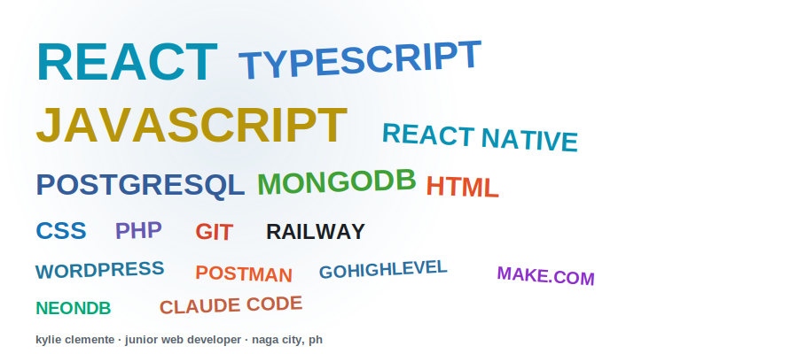

<picture>
  <source media="(prefers-color-scheme: dark)" srcset="./img/stack-poster-dark.svg" />
  <source media="(prefers-color-scheme: light)" srcset="./img/stack-poster-light.svg" />
  
</picture>

  

[mail](mailto:clementeky@gmail.com) · [git](https://github.com/CHEVR0NN) · [linkedin](https://linkedin.com/in/kylie-clemente)

